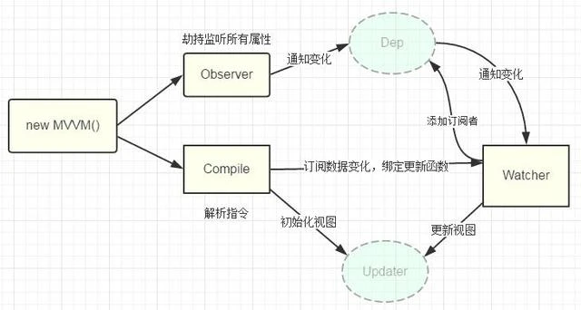

#百度前端训练营大作业：实现一个简单的MVVM框架

###学员：南京大学201250227逹博文

##一、对MVVM框架的理解

####1、MVVM - Model View ViewModel：数据，视图，视图模型。

####2、三者与 Vue 的对应：view 对应 template，vm 对应 new Vue({…})，model 对应 data。

####3、三者的关系：view 可以通过事件绑定的方式影响 model，model 可以通过数据绑定的形式影响到view，viewModel是把 model 和 view 连起来的连接器。

####4、MVVM 框架的三大要素：

1）响应式：该框架如何监听到 data 的每个属性变化。

2）数据劫持: 使用 Object.defineProperty(obj, 'property',{})来定义属性，将对象属性值的设置和访问 (get，set) 都变成函数，分别在设置和获取该对象的该属性时调用执行。

3）模板引擎：该框架的模板如何被解析，指令如何处理

4）渲染：该框架的模板如何被渲染成 html，渲染过程是怎样的

##二、结合概念图深入理解

####1、实现compile,进行模板的编译，包括编译元素（指令）、编译文本等，达到初始化视图的目的，并且还需要绑定好更新函数；

####2、实现Observe,监听所有的数据，并对变化数据发布通知；

####3、实现watcher,作为一个中枢，接收到observe发来的通知，并执行compile中相应的更新方法。

####4、结合上述方法，向外暴露mvvm方法。

##三、具体实现细节

####1、大作业项目目录结构

为了实现单一职责原则，增强模块间的内聚性，降低模块间的耦合性，将业务逻辑代码分文件编写并抽象出公共的方法，使代码的逻辑结构更加清晰。

####2、index.html

用以测试实现的MVVM框架的可用性，框架实现了双向数据绑定v-model与单向数据绑定插值表达式{{}}

####3、mvvm.js

向外暴露的接口，供外界调用创建对象以实现MVVM框架基本功能

####4、compile.js

实现编译模板compile

1)把真实DOM移入到内存中 fragment,减少性能消耗提高效率

2)编译,提取想要的元素节点 v-model 和文本节点 {{}}

3)把编译好的fragment，添加到DOM中

####5、observer.js

实现数据劫持observer

通过js原生的方法Object.defineProperty()来劫持各个属性的setter，getter，在属性对应数据改变时，发布消息给订阅者，然后触发相应的监听回调。

具体实现方法：observe的数据对象进行递归遍历，包括子属性对象的属性，都加上 setter和getter。

####6、watcher.js

实现发布订阅模式watcher

Observer和Compile之间通信的桥梁是Watcher订阅中心，其主要职责是:

1）在自身实例化时往属性订阅器(Dep)里面添加自己，与Observer建立连接；

2）自身有一个update()方法，与Compile建立连接；

3）当属性变化时，Observer中dep.notify()通知，然后能调用自身的update()方法，并触发Compile中绑定的回调，实现更新。

##四、实现效果

文本框内的输入数据与data中的message通过v-model双向绑定。
改变文本框内数据会改变data中的message，改变data中的message也会改变文本框内的输入数据

文本框外的数据与data中的message通过插值表达式{{}}单向绑定。
改变data中的message会改变文本框外内的数据。